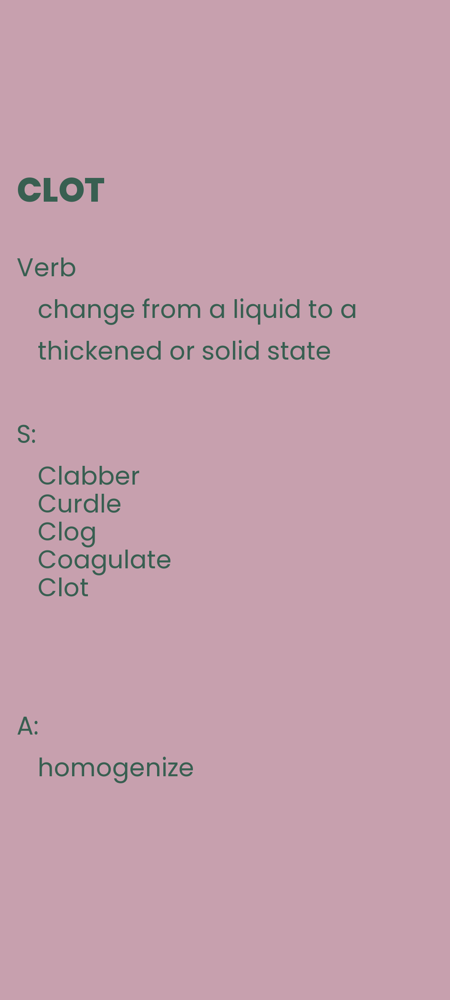
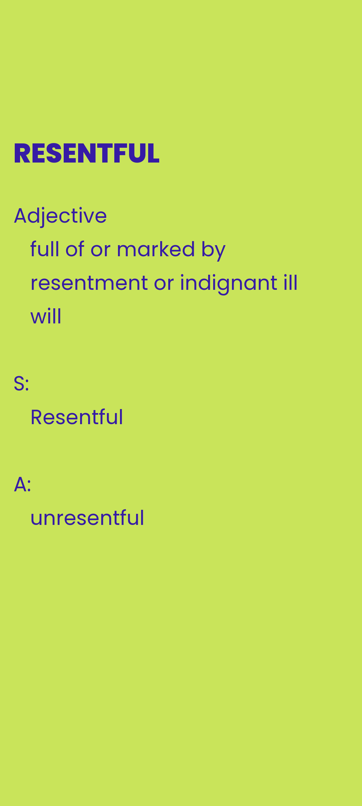
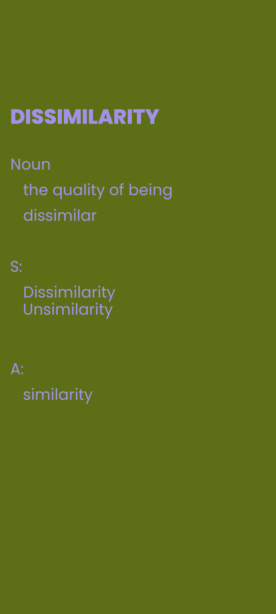

# New Word Wallpaper


Generates phone wallpapers that each feature a **random English word with its meaning, synonyms, and antonyms** — so you passively learn vocabulary every time you glance at your screen. Pair it with your phone's auto-rotating wallpaper feature to see a new word throughout the day.

## Examples





## How it works

- Words and definitions are read from `dictionary.json`.
- For each wallpaper, a random word is picked (and consumed so it won't repeat), skipping any entry missing a meaning, synonyms, or antonyms.
- A `1080×2400` portrait image is drawn with [Pillow](https://python-pillow.org/) using a randomly generated background color (with a complementary text color), and saved into `output/`.

## Run

```bash
pip install pillow
python main.py
```

By default it renders 20 images (`number_of_images_to_render` in `main.py`). Generated wallpapers land in `output/`; copy them to your phone and point your wallpaper rotation at that folder.
